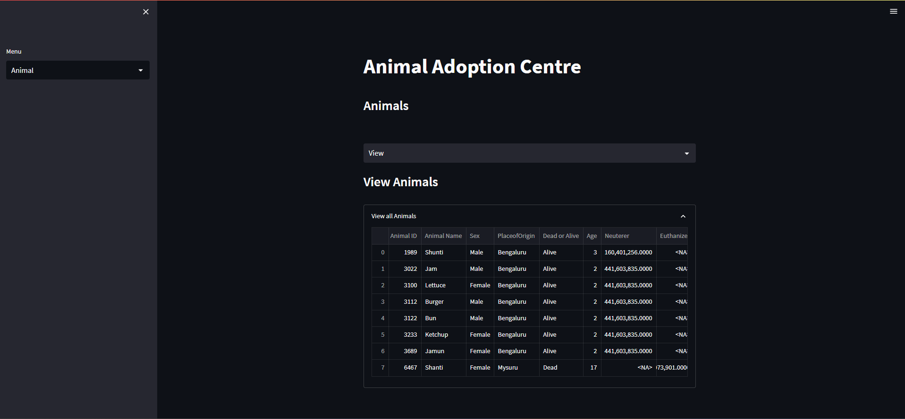
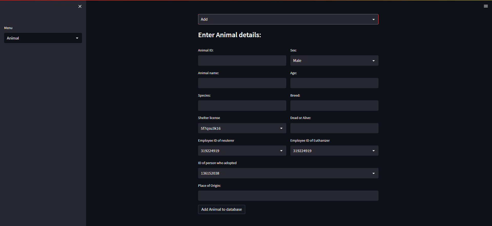

# Animal-Shelter-Database

## Requirements
### User interface
Streamlit library on python.

To run the user interface, 
```
streamlit run app.py
```
in the user interface directory.

In database.py, enter your own password.

### Database
Create a database using the files in the SQL directory. To execute user interface, execution of Database_creation.sql should suffice. 
## Entity-relationship diagram 

## Relation schema

## Snapshots of User Interface



